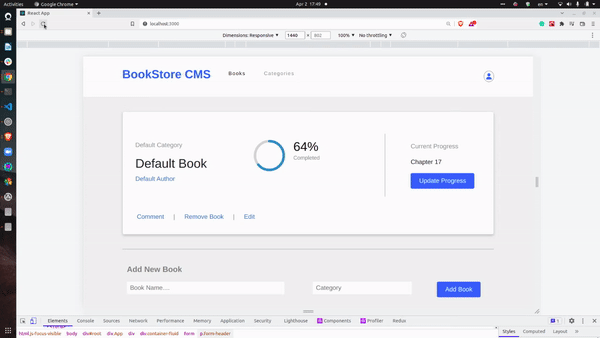

# Title-Info
> This is a Book Store web app where we can choose a book, a category and see the writer and our reading progress.

# GIF/Screenshot

## Built With
- React
- Redux
- React-Router
- Bootstrap
- FontAwesome

## Live Demo
For the link to the live demo, [Click here](https://benevolent-melomakarona-75d9f6.netlify.app/)

## Getting Started
To get a local copy up and running you just need to follow the following steps;
- Clone this repository with
git clone `https://github.com/Tufahel/book-store.git` using your terminal or command line.
- run code `.` to open it in vscode.
- run `npm install` in terminal.
- run `npm run build`.
- run `npm start`.

## Authors

👤 **Author: Tufahel**

- GitHub: [@Tufahel](https://github.com/Tufahel)
- Twitter: [@TufahelAhmed](https://twitter.com/TufahelAhmed)
- LinkedIn: [@Tufahel-Ahmed](https://www.linkedin.com/in/tufahel-ahmed/)

## 🤝 Contributing

Contributions, issues, and feature requests are welcome!

Feel free to check the [issues page](../../issues/).

## Show your support

Give a ⭐️ if you like this project!

## Acknowledgments

- [Zeplin Project](https://app.zeplin.io/project/5b35a9e13227086040f8eb75/screen/5b695e29bb8c844f118f9378)

## 📝 License

This project is [MIT](./MIT.md) licensed.
